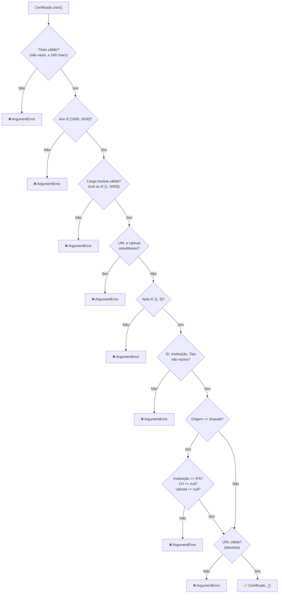

# Especificação Técnica — Entidade `Certificado`

> **Projeto:** IFdex (Cofre de Certificados)  
> **Versão do Documento:** 1.0  
> **Data:** 01/05/2026  
> **Autor:** Engenharia de Software — IFdex Team

---

## Sumário

1. [Objetivo do Domínio](#1-objetivo-do-domínio)
2. [Estrutura do Projeto](#2-estrutura-do-projeto)
3. [Modelo de Dados (Atributos)](#3-modelo-de-dados-atributos)
4. [Regras de Negócio e Validações](#4-regras-de-negócio-e-validações)
5. [Estratégia de Testes (TDD)](#5-estratégia-de-testes-tdd)
6. [Limites de Atuação (Boundaries)](#6-limites-de-atuação-boundaries)

---

## 1. Objetivo do Domínio

A classe `Certificado` é a **entidade central** do sistema IFdex. Ela
representa um registro acadêmico — seja um certificado de participação
em evento, um diploma de curso ou qualquer comprovante de atividade
complementar — dentro do portfólio digital do usuário.

### Papel no Sistema

| Responsabilidade               | Descrição                                                                                                                                            |
|:-------------------------------|:---------------------------------------------------------------------------------------------------------------------------------------------------  |
| **Armazenamento unificado**    | Normaliza dados de duas origens distintas (Sispubli e Manual) em um esquema único, permitindo renderização homogênea na interface.                   |
| **Validação na fronteira**     | Atua como *gatekeeper* do domínio através do Factory `Certificado.criar()`, rejeitando qualquer instanciação que viole invariantes de negócio.       |
| **Segregação de permissões**   | O campo `origem` determina quais atributos são editáveis pelo usuário e quais são bloqueados (read-only), preservando a integridade de dados oficiais|
| **Base para gamificação**      | Cada instância válida alimenta o sistema de XP e progressão de nível do usuário.                                                                     |

> [!NOTE]
> A classe **não possui lógica de persistência**. Na Fase 1
> (MVP/Eixo 1), as instâncias são mantidas exclusivamente em uma
> `List<Certificado>` em memória, gerenciada via `setState`.

---

## 2. Estrutura do Projeto

O projeto segue uma organização inspirada no padrão MVC, com separação
clara de responsabilidades:

```bash
ifdex/
├── lib/
│   ├── models/
│   │   ├── certificado.dart      ← Entidade + Factory (esta spec)
│   │   └── origem_enum.dart      ← Enum de Origem (sispubli | manual)
│   ├── views/                    ← Telas (listagem, cadastro, edição)
│   ├── widgets/                  ← Componentes reutilizáveis
│   ├── theme/                    ← ThemeData e design tokens
│   ├── helpers/                  ← Utilitários
│   └── main.dart                 ← Entry point
├── test/
│   └── certificado_test.dart     ← Suíte de testes unitários (TDD)
├── doc/
│   └── certificado_spec.md       ← Este documento
└── docs/
    └── *.pdf                     ← Documentos acadêmicos de referência
```

| Diretório     | Finalidade                                                                                       |
|:--------------|:-------------------------------------------------------------------------------------------------|
| `lib/models/` | Definição da entidade e seus tipos auxiliares. Todo acesso externo ao modelo passa pelo Factory. |
| `test/`       | Testes unitários automatizados cobrindo 100% das regras do Factory. Executados via `make check`. |
| `doc/`        | Documentação técnica de engenharia (especificações, decisões de arquitetura).                    |

---

## 3. Modelo de Dados (Atributos)

### Tabela de Atributos

| Campo             | Tipo Dart      | Obrigatório  | Mutável       | Descrição                                                                                                      |
|:------------------|:---------------|:------------:|:-------------:|:---------------------------------------------------------------------------------------------------------------|
| `id`              | `String`       | ✅           | Não (`final`) | Identificador único. SHA-256 (Sispubli) ou UUID v4 (Manual).                                                   |
| `origem`          | `Origem`       | ✅           | Não (`final`) | Enum que classifica a procedência: `sispubli` ou `manual`.                                                     |
| `titulo`          | `String`       | ✅           | Sim           | Nome do certificado. Máximo de 100 caracteres.                                                                 |
| `ano`             | `int`          | ✅           | Sim           | Ano de emissão. Intervalo válido: 1900–2026.                                                                   |
| `instituicao`     | `String`       | ✅           | Sim           | Instituição emissora. Fixo como "IFS" para origem Sispubli.                                                    |
| `tipoDescricao`   | `String`       | ✅           | Sim           | Categoria descritiva (ex: "Participação", "Ouvinte").                                                          |
| `cargaHoraria`    | `int?`         | ❌           | Sim           | Horas do certificado. Se informada, deve estar entre 1 e 5000. **Proibida para Sispubli.**                     |
| `urlDocumento`    | `String?`      | ❌           | Sim           | URL absoluta para o documento digital. Mutuamente exclusiva com `uploadDocumento`.                             |
| `uploadDocumento` | `Uint8List?`   | ❌           | Sim           | Bytes do arquivo (PDF/JPG/PNG, máx. 5 MB). Mutuamente exclusivo com `urlDocumento`. **Proibido para Sispubli.**|
| `tags`            | `List<String>` | ✅           | Sim           | Lista de tags de categorização. Pode ser vazia (`[]`).                                                         |
| `notaRelevancia`  | `int`          | ✅           | Sim           | Nota subjetiva de importância. Intervalo válido: 1–5.                                                          |

### Enum `Origem`

```dart
enum Origem { sispubli, manual }
```

| Valor      | Semântica                                                                                                                       |
|:-----------|:--------------------------------------------------------------------------------------------------------------------------------|
| `sispubli` | Dados importados da API oficial do IFS. Campos-chave são read-only e há restrições adicionais (sem carga horária, sem upload).  |
| `manual`   | Dados inseridos pelo usuário. Todos os campos editáveis são livres, respeitando apenas os limites de domínio.                   |

---

## 4. Regras de Negócio e Validações

O Factory `Certificado.criar()` é o único ponto de criação de
instâncias. Seu construtor nominal é **privado** (`Certificado._()`),
garantindo que toda instanciação passe pelo crivo de validação. Abaixo,
as regras estão documentadas na ordem de execução do Factory.

### 4.1 Validação de Título

- O campo `titulo` é **obrigatório**.
- Não pode ser uma string vazia nem composta apenas por espaços em
  branco (avaliado via `titulo.trim().isEmpty`).
- O comprimento máximo é de **100 caracteres** (inclusive).
- **Erro:** `ArgumentError` com mensagem descritiva.

### 4.2 Validação de Ano

- O campo `ano` deve estar no intervalo fechado **[1900, 2026]**.
- Valores fora desse intervalo (ex: 1899 ou 2027) são rejeitados.
- **Erro:** `ArgumentError`.

### 4.3 Validação de Carga Horária

- O campo `cargaHoraria` é **opcional** (`null` é aceito).
- Quando informado, deve estar no intervalo fechado **[1, 5000]**.
- Valores como `0` ou `5001` são rejeitados.
- **Erro:** `ArgumentError`.

### 4.4 Exclusão Mútua (URL vs. Upload)

- Os campos `urlDocumento` e `uploadDocumento` são **mutuamente
  exclusivos**.
- Se `urlDocumento` for não-nula **e** não-vazia (`isNotEmpty`), e
  `uploadDocumento` for não-nulo simultaneamente, a criação é
  rejeitada.
- É válido fornecer:
  - Apenas URL (sem upload).
  - Apenas upload (sem URL).
  - Nenhum dos dois (certificado sem anexo).
- **Erro:** `ArgumentError` — *"Forneça uma URL ou um Arquivo, não
  ambos."*

### 4.5 Validação de Nota de Relevância

- O campo `notaRelevancia` é **obrigatório**.
- Deve estar no intervalo fechado **[1, 5]**.
- Valores como `0` ou `6` são rejeitados.
- **Erro:** `ArgumentError`.

### 4.6 Validação de Strings Obrigatórias

- Os campos `id`, `instituicao` e `tipoDescricao` **não podem ser
  vazios** (avaliados via `trim().isEmpty`).
- Esta validação ocorre **antes** das regras específicas do Sispubli,
  garantindo que um ID em branco não passe despercebido.
- **Erro:** `ArgumentError` — *"ID, Instituição e Tipo de Descrição
  não podem ser vazios."*

### 4.7 Regras Específicas do Sispubli

Quando `origem == Origem.sispubli`, três restrições adicionais são
aplicadas para refletir as limitações da API oficial:

| Regra                      | Detalhe                                                             | Justificativa                                                                  |
| :------------------------- | :------------------------------------------------------------------ | :----------------------------------------------------------------------------- |
| **Instituição fixa**       | `instituicao.trim().toUpperCase()` deve ser exatamente `'IFS'`.     | Todos os certificados do Sispubli pertencem ao Instituto Federal de Sergipe.   |
| **Carga horária proibida** | `cargaHoraria` **deve ser `null`**.                                 | A API do Sispubli não fornece esse dado.                                       |
| **Upload proibido**        | `uploadDocumento` **deve ser `null`**.                              | A API fornece apenas a URL permanente do documento; não há upload de arquivos. |

- **Erro:** `ArgumentError` com mensagem específica para cada violação.

### 4.8 Validação de Formato de URL

- Executada apenas quando `urlDocumento` é não-nula e não-vazia.
- Utiliza `Uri.tryParse()` para verificar se a string é uma URI
  válida.
- A URI deve ser **absoluta** (`uri.isAbsolute == true`), ou seja,
  possuir scheme (ex: `https://`).
- Strings como `'wwwgooglecom'` ou `'link falso'` são rejeitadas.
- **Erro:** `ArgumentError` — *"A URL fornecida é inválida."*

### Diagrama de Fluxo do Factory



---

## 5. Estratégia de Testes (TDD)

A suíte de testes segue a abordagem **Test-Driven Development**,
garantindo que cada regra de negócio do Factory esteja coberta por ao
menos um caso de teste automatizado. Os testes são categorizados por
natureza de verificação.

### 5.1 Caminhos Felizes (Sucesso)

Validam que instâncias legítimas são criadas sem erros.

| #  | Caso de Teste                              | Verificação                                                                         |
|:-: |:-------------------------------------------|:------------------------------------------------------------------------------------|
| 1  | Certificado manual válido com URL          | Objeto instanciado com `urlDocumento` preenchida e sem `uploadDocumento`.           |
| 2  | Certificado manual válido com Upload       | Objeto instanciado com `Uint8List` (bytes simulados) e sem URL.                     |
| 3  | Certificado manual válido sem anexos       | Ambos `urlDocumento` e `uploadDocumento` são `null`.                                |
| 4  | Certificado Sispubli válido                | `origem == Origem.sispubli`, `instituicao == 'IFS'`, sem carga horária, sem upload. |

### 5.2 Exclusão Mútua (Anexos)

| #  | Caso de Teste                                 | Verificação                                            |
|:-: |:----------------------------------------------|:-------------------------------------------------------|
| 5  | Erro ao fornecer URL e Upload simultaneamente | `ArgumentError` disparado quando ambos são fornecidos. |

### 5.3 Restrição de Domínio (Limites Numéricos)

Validam que valores fora dos intervalos definidos são rejeitados.

| #  | Caso de Teste                       | Entrada                             | Resultado Esperado   |
|:-: |:----------------------------------- |:------------------------------------|:---------------------|
| 6  | Ano abaixo do mínimo                | `ano = 1899`                        | `ArgumentError`      |
| 7  | Ano acima do máximo                 | `ano = 2027`                        | `ArgumentError`      |
| 8  | Carga horária abaixo do mínimo      | `cargaHoraria = 0`                  | `ArgumentError`      |
| 9  | Carga horária acima do máximo       | `cargaHoraria = 5001`               | `ArgumentError`      |
| 10 | Nota de relevância abaixo do mínimo | `notaRelevancia = 0`                | `ArgumentError`      |
| 11 | Nota de relevância acima do máximo  | `notaRelevancia = 6`                | `ArgumentError`      |

### 5.4 Regras de Strings e Negócio

Validam strings obrigatórias, limites de comprimento e formato.

| #  | Caso de Teste                        | Entrada                                          | Resultado Esperado   |
|:-: |:-------------------------------------|:-------------------------------------------------|:---------------------|
| 12 | Título vazio                         | `''` ou `'   '` (espaços)                        | `ArgumentError`      |
| 13 | Título acima de 100 caracteres       | String com 101 chars                             | `ArgumentError`      |
| 14 | URL com formato inválido             | `'wwwgooglecom'` ou `'link falso'`               | `ArgumentError`      |
| 15 | ID, Instituição ou Tipo vazios       | Strings vazias nos campos obrigatórios           | `ArgumentError`      |
| 16 | Sispubli com instituição ≠ IFS       | `instituicao = 'Udemy'` com `Origem.sispubli`    | `ArgumentError`      |

### 5.5 Limites Exatos (Boundary Values)

Validam que os operadores matemáticos (`<=` vs `<`) estão corretos,
testando os valores exatos das fronteiras.

| #  | Caso de Teste                         | Entradas Testadas                               | Resultado Esperado     |
|:-: |-------------------------------------- |:------------------------------------------------|:-----------------------|
| 17 | Ano nos limites exatos                | `ano = 1900` e `ano = 2026`                     | ✅ Instância criada    |
| 18 | Carga horária nos limites exatos      | `cargaHoraria = 1` e `cargaHoraria = 5000`      | ✅ Instância criada    |
| 19 | Nota de relevância nos limites exatos | `notaRelevancia = 1` e `notaRelevancia = 5`     | ✅ Instância criada    |
| 20 | Título com exatamente 100 caracteres  | String de 100 chars                             | ✅ Instância criada    |

### 5.6 Casos de Borda (Arrays e Nulls)

Validam comportamento com entradas nulas ou coleções vazias.

| #  | Caso de Teste                  | Entrada                                       | Resultado Esperado                               |
|:-: |------------------------------  |:--------------------------------------------- |------------------------------------------------  |
| 21 | Lista de tags vazia            | `tags: []`                                    | ✅ Instância criada (tags vazias são permitidas) |
| 22 | Carga horária nula para Manual | `cargaHoraria: null` com `Origem.manual`      | ✅ Instância criada (campo é opcional)           |

### 5.7 Regras do Sispubli (Exceções)

Validam as restrições exclusivas de dados originados da API oficial.

| #  | Caso de Teste                    | Entrada                                         | Resultado Esperado         |
|:-: |----------------------------------|-------------------------------------------------|----------------------------|
| 23 | Sispubli com carga horária       | `Origem.sispubli` + `cargaHoraria = 40`         | `ArgumentError`            |
| 24 | Sispubli com upload de documento | `Origem.sispubli` + `uploadDocumento` com bytes | `ArgumentError`            |

### Resumo de Cobertura

```bash
Total de casos de teste: 24
├── Caminhos Felizes:          4 testes
├── Exclusão Mútua:            1 teste
├── Limites Numéricos:         6 testes
├── Regras de Strings:         5 testes
├── Boundary Values:           4 testes
├── Casos de Borda:            2 testes
└── Regras Sispubli:           2 testes
```

> [!IMPORTANT]
> Todos os testes devem ser executados via `make check` antes de
> aprovar qualquer alteração no Factory. A suíte utiliza
> exclusivamente `fvm flutter test` para garantir compatibilidade
> com a versão travada do Flutter (3.41.7).

---

## 6. Limites de Atuação (Boundaries)

Diretrizes para futuras manutenções do modelo `Certificado` e seu
Factory constructor.

### ✅ Sempre faça

- **Rode os testes antes de aprovar mudanças no Factory.** Qualquer
  alteração nas regras de validação deve ser acompanhada de pelo menos
  um teste novo ou atualizado.
- **Mantenha o construtor privado.** Toda instanciação deve
  obrigatoriamente passar pelo `Certificado.criar()`, preservando as
  invariantes de domínio.
- **Documente novas regras nesta spec.** Se uma validação for
  adicionada ao Factory, ela deve ser refletida na Seção 4 (Regras
  de Negócio) e na Seção 5 (Estratégia de Testes).
- **Valide strings com `trim()`.** Espaços em branco não devem
  contornar validações de obrigatoriedade.
- **Use `ArgumentError` para rejeições.** Manter consistência no
  tipo de exceção facilita o tratamento na camada de apresentação.

### ⚠️ Pergunte primeiro

- **Antes de adicionar novos campos obrigatórios à entidade.** Isso
  pode quebrar a serialização futura (Firestore) e exigir migrações
  de dados.
- **Antes de alterar os intervalos numéricos** (ano, carga horária,
  nota). Mudanças nos limites afetam dados já existentes e podem
  invalidar certificados previamente aceitos.
- **Antes de modificar a regra de exclusão mútua URL/Upload.**
  A arquitetura de micro-frontends (Next.js) depende dessa
  invariante para o roteamento dinâmico de documentos.
- **Antes de alterar a tipagem de `uploadDocumento`.** A escolha de
  `Uint8List` é deliberada para compatibilidade com a stack de
  compressão e upload ao Firebase Storage.
- **Antes de relaxar validações do Sispubli.** As restrições
  (instituição fixa, sem carga horária, sem upload) refletem
  limitações reais da API oficial e não devem ser flexibilizadas
  sem evidência de mudança na API.

### 🚫 Nunca faça

- **Nunca exponha o construtor privado `Certificado._()`.**
  Contornar o Factory anula toda a camada de validação e introduz
  estados inválidos no sistema.
- **Nunca ignore as validações específicas da origem Sispubli.**
  Essas regras protegem a integridade de dados oficiais importados
  de uma API governamental.
- **Nunca remova testes existentes sem justificativa documentada.**
  Cada teste valida uma regra de negócio explícita; removê-lo cria
  uma lacuna de cobertura silenciosa.
- **Nunca permita instanciação sem validação de `titulo`.**
  O título é o campo de exibição primário em toda a UI; um título
  vazio corromperia cards, listas e compartilhamentos.
- **Nunca use `setState` ou lógica de UI dentro do modelo.**
  `Certificado` é uma entidade de domínio pura — ela não deve
  conhecer Flutter, widgets ou contexto de renderização.

---

> **Próximos passos:** Após a implementação do Factory e da suíte
> de testes conforme esta especificação, executar `make check` para
> validar a integridade completa do pipeline (format → analyze →
> test).
