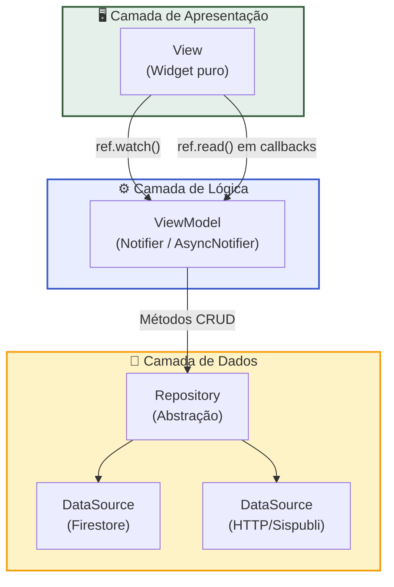
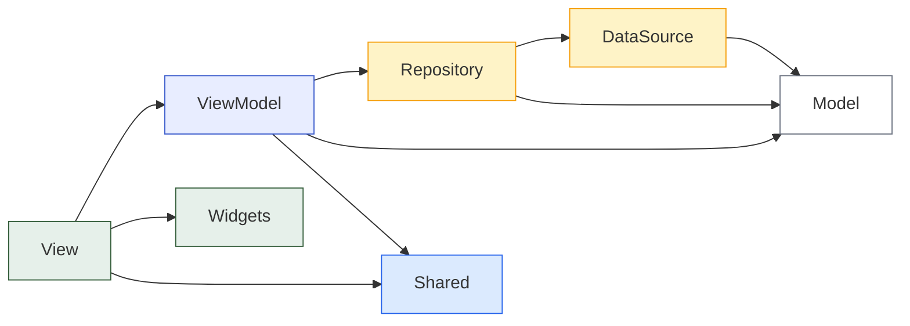
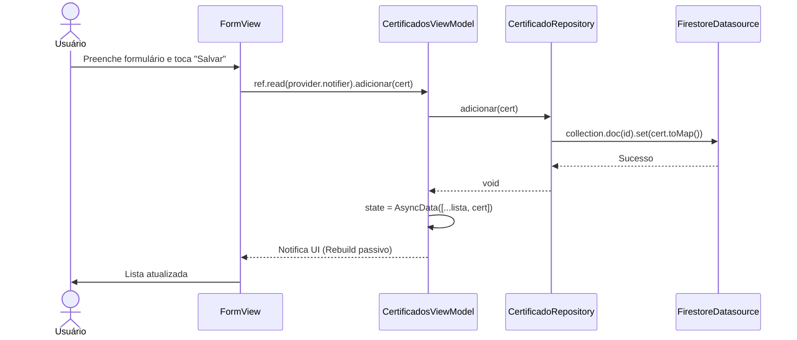

# 🏗️ Especificação de Arquitetura — IFdex (Eixo 2)

> **Versão:** 1.0
> **Última Atualização:** 2026-06-16
> **Issue de Origem:** [#28 — Definir Especificação de Arquitetura MVVM + Feature-first](https://github.com/JGustavoCN/ifdex/issues/28)
> **Status:** ❄️ Arquitetura Aprovada e Congelada (Mudanças futuras exigem justificativa arquitetural)

## 1. Propósito

Este documento é a **Fonte Única da Verdade (SSOT)** para a organização de código do IFdex a partir do Eixo 2. Ele padroniza a interpretação de "MVVM + Riverpod + Feature-first" para que **todo desenvolvedor (humano ou IA)** produza código consistente, testável e auditável.

### 1.1 Problema que Resolve

| Problema                                | Solução Neste Documento                                  |
| :-------------------------------------- | :------------------------------------------------------- |
| Ambiguidade sobre o que é "MVVM"        | Definição formal de cada camada e suas responsabilidades |
| Cada desenvolvedor cria pastas diferentes | Mapa canônico da estrutura `lib/`                       |
| Imports circulares e acoplamento        | Regras estritas de dependência entre camadas             |
| Inconsistência de nomenclatura          | Tabela de convenções com exemplos para cada tipo de arquivo |
| Risco na migração do Eixo 1             | Plano de migração incremental mapeando arquivo a arquivo |

---

## 2. Diagrama de Camadas (Fluxo de Dados)



**Fluxo unidirecional:**

1. A **View** observa o estado do **ViewModel** via `ref.watch()`.
2. Ações do usuário (tap, submit) chamam métodos no **ViewModel** via `ref.read()`.
3. O **ViewModel** orquestra um ou mais **Repositories**.
4. O **Repository** delega a chamada concreta ao **DataSource** apropriado.
5. Os dados retornam pela cadeia e o Riverpod notifica a View para reconstruir.

---

## 3. Estrutura de Pastas `lib/`

```
lib/
├── app/                              # Configuração global do aplicativo
│   ├── app.dart                      # Widget MaterialApp + ProviderScope
│   └── routes.dart                   # Definição de rotas (se usar go_router)
│
├── features/                         # Features isoladas (Feature-first)
│   ├── certificados/                 # Feature principal
│   │   ├── data/                     # Camada de Dados
│   │   │   ├── certificado_repository.dart
│   │   │   ├── certificado_firestore_datasource.dart
│   │   │   └── sispubli_datasource.dart
│   │   │
│   │   ├── models/                   # Entidades e DTOs
│   │   │   ├── certificado.dart
│   │   │   ├── certificado_types.dart
│   │   │   └── origem_enum.dart
│   │   │
│   │   ├── presentation/            # Views + ViewModels
│   │   │   ├── certificados_view_model.dart
│   │   │   ├── certificado_details_view.dart
│   │   │   └── certificado_form_view.dart
│   │   │
│   │   └── widgets/                  # Componentes visuais da feature
│   │       ├── certificado_card.dart
│   │       ├── certificado_cover.dart
│   │       └── info_box.dart
│   │
│   ├── gamificacao/                  # Feature de gamificação
│   │   ├── models/
│   │   │   └── gamification.dart
│   │   ├── presentation/
│   │   │   └── gamificacao_view_model.dart
│   │   └── widgets/
│   │       └── xp_header.dart
│   │
│   ├── home/                         # Feature Shell / Dashboard
│   │   └── presentation/             # Orquestra widgets de outras features
│   │       ├── home_view.dart
│   │       ├── home_mobile_view.dart
│   │       └── home_web_view.dart
│   │
│   └── auth/                         # Feature de autenticação
│       ├── data/
│       │   └── auth_repository.dart
│       └── presentation/
│           └── auth_view_model.dart
│
├── shared/                           # Código transversal (cross-cutting)
│   ├── theme/                        # Design System
│   │   └── app_theme.dart
│   ├── widgets/                      # Widgets reutilizáveis globais
│   │   ├── app_text.dart
│   │   ├── remove_button.dart
│   │   ├── app_loading_state.dart
│   │   ├── app_error_state.dart
│   │   └── app_empty_state.dart
│   ├── constants/                    # Constantes globais
│   │   └── app_constants.dart
│   └── extensions/                   # Extension methods utilitários
│       └── string_extensions.dart
│
├── main.dart                         # Entry point (bootstrap)
└── firebase_options.dart             # (mantido na raiz por padrão FlutterFire)
```

### 3.1 Glossário de Pastas

| Pasta              | Escopo                     | Conteúdo                                                        |
| :----------------- | :------------------------- | :-------------------------------------------------------------- |
| `app/`             | Global                     | Configuração do app, rotas e bootstrap do Firebase               |
| `features/<nome>/` | Isolado por domínio        | Tudo que pertence exclusivamente a uma feature                   |
| `features/*/data/` | Camada de Dados            | Repositories e DataSources concretos                             |
| `features/*/models/` | Camada de Domínio        | Entidades (classes de dados), enums e DTOs                       |
| `features/*/presentation/` | Camada de Apresentação | Views (Widgets) e ViewModels (Notifiers)                  |
| `features/*/widgets/` | UI específica da feature | Componentes visuais que só fazem sentido dentro dessa feature    |
| `shared/`          | Cross-cutting              | Código reutilizado por **2+ features** (theme, widgets, utils)   |

> [!IMPORTANT]
> **Regra de Promoção:** Um widget ou classe só deve ser movido para `shared/` quando for consumido por **duas ou mais features**. Caso contrário, permanece dentro da pasta `widgets/` da feature que o utiliza.

---

## 4. Responsabilidades de Cada Camada

### 4.1 View (Widget)

```dart
// ✅ CORRETO: View consome estado e delega ações
class HomeView extends ConsumerWidget {
  @override
  Widget build(BuildContext context, WidgetRef ref) {
    final state = ref.watch(certificadosViewModelProvider);
    return state.when(
      loading: () => const AppLoadingState(),
      error: (e, _) => AppErrorState(message: e.toString()),
      data: (certs) => ListView.builder(/* ... */),
    );
  }
}

// ❌ ERRADO: View faz chamada HTTP diretamente
class HomeView extends ConsumerWidget {
  @override
  Widget build(BuildContext context, WidgetRef ref) {
    final response = http.get(Uri.parse('...')); // PROIBIDO
  }
}
```

| Aspecto       | Regra                                                                 |
| :------------ | :-------------------------------------------------------------------- |
| **Faz**       | Renderizar UI, consumir estado via `ref.watch()`, chamar ações via `ref.read()` |
| **Não faz**   | Lógica de negócio, chamadas HTTP, acesso ao Firestore                 |
| **setState**  | Permitido **apenas** para estado local de UI (animação, controller de texto, foco) |
| **Tipo**      | `ConsumerWidget`, `ConsumerStatefulWidget` ou `HookConsumerWidget`    |

### 4.2 ViewModel (Notifier)

```dart
// ✅ CORRETO: ViewModel orquestra Repository
@riverpod
class CertificadosViewModel extends _$CertificadosViewModel {
  @override
  Future<List<Certificado>> build() async {
    final repo = ref.read(certificadoRepositoryProvider);
    return repo.listarTodos();
  }

  Future<void> adicionar(Certificado cert) async {
    final repo = ref.read(certificadoRepositoryProvider);
    await repo.salvar(cert);
    ref.invalidateSelf(); // Recarrega a lista
  }
}
```

| Aspecto       | Regra                                                                  |
| :------------ | :--------------------------------------------------------------------- |
| **Faz**       | Orquestra repositories, transforma dados para a UI, gerencia estado    |
| **Não faz**   | Renderizar widgets, acessar `BuildContext`, chamar `Navigator`         |
| **Tipo**      | `Notifier`, `AsyncNotifier` ou `StateNotifier` (legado, evitar em código novo) |
| **Exposição** | Sempre via `Provider` do Riverpod                                      |

### 4.3 Repository (Abstração)

```dart
// ✅ CORRETO: Repository abstrai a origem dos dados
class CertificadoRepository {
  final CertificadoFirestoreDatasource _firestore;
  final SispubliDatasource _sispubli;

  CertificadoRepository(this._firestore, this._sispubli);

  Future<List<Certificado>> listarTodos() =>
      _firestore.listarTodos();

  Future<List<Certificado>> importarSispubli(String cpf) =>
      _sispubli.buscarCertificados(cpf);

  Future<void> salvar(Certificado cert) =>
      _firestore.salvar(cert);
}
```

| Aspecto       | Regra                                                                       |
| :------------ | :-------------------------------------------------------------------------- |
| **Faz**       | Abstrair a origem dos dados, combinar múltiplos DataSources, cache leve     |
| **Não faz**   | Renderizar UI, gerenciar estado reativo, conter lógica de apresentação      |
| **Conhece**   | Interfaces dos DataSources, modelos do domínio                              |
| **Injeção**   | Injetado no ViewModel via Riverpod Provider                                 |

### 4.4 DataSource (Implementação Concreta)

```dart
// ✅ Firestore DataSource
class CertificadoFirestoreDatasource {
  final FirebaseFirestore _db;

  CertificadoFirestoreDatasource(this._db);

  Future<List<Certificado>> listarTodos() async {
    final snap = await _db
        .collection('users')
        .doc(uid)
        .collection('certificados')
        .get();
    return snap.docs
        .map((d) => Certificado.fromMap(d.data()))
        .toList();
  }
}

// ✅ HTTP DataSource (Sispubli)
class SispubliDatasource {
  Future<List<Certificado>> buscarCertificados(
    String cpf,
  ) async {
    final response = await http.get(
      Uri.parse('https://sispubli-api.vercel.app/api/...'),
    );
    // Parse + conversão para Certificado
  }
}
```

| Aspecto       | Regra                                                          |
| :------------ | :------------------------------------------------------------- |
| **Faz**       | Comunicação direta com APIs externas, Firestore, Storage       |
| **Não faz**   | Lógica de negócio, combinar fontes de dados                    |
| **Serialização** | `toMap()` / `fromMap()` para Firestore; JSON parse para HTTP |
| **Nomeação**  | Sufixo `_datasource.dart`                                      |

### 4.5 Model (Entidade)

| Aspecto       | Regra                                                              |
| :------------ | :----------------------------------------------------------------- |
| **Faz**       | Representar dados do domínio, validar invariantes, serializar      |
| **Não faz**   | Depender do Flutter, importar widgets, chamar APIs                 |
| **Serialização** | Métodos `toMap()` e factory `fromMap()` para Firestore          |
| **Imutabilidade** | Preferir campos `final`. Usar `copyWith()` para mutações       |

---

## 5. Convenções de Nomenclatura

### 5.1 Arquivos

| Tipo de Arquivo   | Padrão de Nome                        | Exemplo                                  |
| :---------------- | :------------------------------------ | :--------------------------------------- |
| **Model**         | `<entidade>.dart`                     | `certificado.dart`                       |
| **Enum**          | `<nome>_enum.dart`                    | `origem_enum.dart`                       |
| **Types / Consts** | `<entidade>_types.dart`              | `certificado_types.dart`                 |
| **View**          | `<tela>_view.dart`                    | `home_view.dart`, `certificado_form_view.dart` |
| **ViewModel**     | `<feature>_view_model.dart`           | `certificados_view_model.dart`           |
| **Repository**    | `<entidade>_repository.dart`          | `certificado_repository.dart`            |
| **DataSource**    | `<entidade>_<provider>_datasource.dart` | `certificado_firestore_datasource.dart` |
| **Widget**        | `<componente>.dart` (snake_case)      | `certificado_card.dart`, `xp_header.dart` |
| **Extension**     | `<tipo>_extensions.dart`              | `string_extensions.dart`                 |
| **Teste**         | `<arquivo_testado>_test.dart`         | `certificado_test.dart`, `certificados_view_model_test.dart` |

### 5.2 Classes

| Tipo              | Padrão de Nome (PascalCase)          | Exemplo                                |
| :---------------- | :----------------------------------- | :------------------------------------- |
| **Model**         | `<Entidade>`                         | `Certificado`                          |
| **View Widget**   | `<Tela>View`                         | `HomeView`, `CertificadoFormView`      |
| **ViewModel**     | `<Feature>ViewModel`                 | `CertificadosViewModel`                |
| **Repository**    | `<Entidade>Repository`               | `CertificadoRepository`                |
| **DataSource**    | `<Entidade><Provider>Datasource`     | `CertificadoFirestoreDatasource`       |
| **Widget**        | `<NomeDescritivo>`                   | `CertificadoCard`, `XpHeader`          |

### 5.3 Providers (Riverpod)

| Tipo                  | Padrão de Nome (camelCase)          | Exemplo                                    |
| :-------------------- | :---------------------------------- | :----------------------------------------- |
| **ViewModel Provider** | `<feature>ViewModelProvider`        | `certificadosViewModelProvider`            |
| **Repository Provider** | `<entidade>RepositoryProvider`    | `certificadoRepositoryProvider`            |
| **DataSource Provider** | `<entidade><Provider>DatasourceProvider` | `certificadoFirestoreDatasourceProvider` |
| **State simples**     | `<descricao>Provider`               | `filtroAtualProvider`                      |

---

## 6. Regras de Dependência (Quem Importa Quem)



### 6.1 Matriz de Permissões

| Módulo Origem → | View | ViewModel | Repository | DataSource | Model | Shared |
| :-------------- | :--: | :-------: | :--------: | :--------: | :---: | :----: |
| **View**        | —    | ✅        | ❌         | ❌         | ✅ (leitura) | ✅ |
| **ViewModel**   | ❌   | —         | ✅         | ❌         | ✅    | ✅     |
| **Repository**  | ❌   | ❌        | —          | ✅         | ✅    | ✅     |
| **DataSource**  | ❌   | ❌        | ❌         | —          | ✅    | ✅     |
| **Model**       | ❌   | ❌        | ❌         | ❌         | —     | ✅ (limitado) |
| **Shared**      | ❌   | ❌        | ❌         | ❌         | ❌    | —      |

> [!CAUTION]
> **Regras Invioláveis:**
>
> - A **View** NUNCA importa `Repository` ou `DataSource` diretamente.
> - O **ViewModel** NUNCA importa `DataSource` diretamente (sempre via Repository).
> - O **Model** NUNCA depende do Flutter (`package:flutter/...`). Deve ser Dart puro.
> - **Imports circulares** entre features são PROIBIDOS. Se duas features precisam compartilhar código, ele deve ser promovido para `shared/`.

### 6.2 Imports Entre Features

```
❌ PROIBIDO:
import 'package:ifdex/features/gamificacao/presentation/gamificacao_view_model.dart';
// ... dentro de features/certificados/

✅ PERMITIDO (se necessário, via shared):
import 'package:ifdex/shared/providers/gamificacao_provider.dart';
// ... provider exposto em shared para consumo cruzado
```

> [!TIP]
> Na prática, `gamificacao` e `certificados` podem se comunicar via Riverpod. O `GamificacaoViewModel` observa o `CertificadosViewModel` usando `ref.watch()`, sem criar dependência direta de importação entre as features. Esse padrão de **comunicação reativa entre features via Riverpod** é o recomendado.

---

## 7. Exemplo Prático: Feature `certificados`

### 7.1 Estrutura de Pastas

```
lib/features/certificados/
├── data/
│   ├── certificado_repository.dart        # Abstrai Firestore + Sispubli
│   ├── certificado_firestore_datasource.dart  # CRUD Firestore
│   └── sispubli_datasource.dart           # GET HTTP → Sispubli API
├── models/
│   ├── certificado.dart                   # Entidade + validações + toMap/fromMap
│   ├── certificado_types.dart             # Constantes de tipos
│   └── origem_enum.dart                   # Enum Origem { sispubli, manual }
├── presentation/
│   ├── certificados_view_model.dart       # AsyncNotifier com CRUD
│   ├── home_view.dart                     # Tela principal (LayoutBuilder)
│   ├── home_mobile_view.dart              # Layout mobile (ConsumerWidget)
│   ├── home_web_view.dart                 # Layout web/desktop (ConsumerWidget)
│   ├── certificado_details_view.dart      # Tela de detalhes (leitura)
│   └── certificado_form_view.dart         # Tela de cadastro/edição
└── widgets/
    ├── certificado_card.dart              # Card de item na lista
    ├── certificado_cover.dart             # Thumbnail/Cover visual
    └── info_box.dart                      # Box read-only para campos bloqueados
```

### 7.2 Ciclo de Vida Completo (Adicionar Certificado)



### 7.3 Exemplo de Código — ViewModel

```dart
// lib/features/certificados/presentation/certificados_view_model.dart

import 'package:riverpod_annotation/riverpod_annotation.dart';
import '../data/certificado_repository.dart';
import '../models/certificado.dart';

part 'certificados_view_model.g.dart';

@riverpod
class CertificadosViewModel
    extends _$CertificadosViewModel {

  @override
  Future<List<Certificado>> build() async {
    final repo =
        ref.read(certificadoRepositoryProvider);
    return repo.listarTodos();
  }

  Future<void> adicionar(Certificado cert) async {
    final repo = ref.read(certificadoRepositoryProvider);
    await repo.adicionar(cert);
    if (state is AsyncData) {
      final atual = state.requireValue;
      state = AsyncData([...atual, cert]);
    }
  }

  Future<void> remover(String id) async {
    final repo = ref.read(certificadoRepositoryProvider);
    await repo.remover(id);
    if (state is AsyncData) {
      final atual = state.requireValue;
      state = AsyncData(atual.where((c) => c.id != id).toList());
    }
  }
}
```

### 7.4 Exemplo de Código — View Consumindo Estado

```dart
// Dentro de home_mobile_view.dart
class HomeMobileView extends ConsumerWidget {
  const HomeMobileView({super.key});

  @override
  Widget build(BuildContext context, WidgetRef ref) {
    final state =
        ref.watch(certificadosViewModelProvider);

    return state.when(
      loading: () => const AppLoadingState(),
      error: (e, _) => AppErrorState(
        message: e.toString(),
        onRetry: () => ref.invalidate(
          certificadosViewModelProvider,
        ),
      ),
      data: (certificados) {
        if (certificados.isEmpty) {
          return const AppEmptyState(
            message: 'Nenhum certificado encontrado.',
          );
        }
        return ListView.builder(
          itemCount: certificados.length,
          itemBuilder: (ctx, i) =>
              CertificadoCard(certificado: certificados[i]),
        );
      },
    );
  }
}
```

---

## 8. Widgets Compartilhados de Estado Assíncrono

O Eixo 2 exige tratamento visual de loading, erro e vazio em **toda tela que consome dados**. Para evitar duplicação, três widgets padronizados devem existir em `shared/widgets/`:

| Widget            | Arquivo                  | Uso                                              |
| :---------------- | :----------------------- | :----------------------------------------------- |
| `AppLoadingState` | `app_loading_state.dart` | Shimmer ou spinner centralizado                  |
| `AppErrorState`   | `app_error_state.dart`   | Ícone de erro + mensagem + botão "Tentar de novo"|
| `AppEmptyState`   | `app_empty_state.dart`   | Ilustração + mensagem amigável de lista vazia    |

Estes widgets são consumidos via `AsyncValue.when()` do Riverpod:

```dart
state.when(
  loading: () => const AppLoadingState(),
  error: (e, _) => AppErrorState(message: '$e'),
  data: (items) => items.isEmpty
      ? const AppEmptyState()
      : ListView.builder(/* ... */),
);
```

---

## 9. Regras Complementares

### 9.1 Sobre `setState`

| Contexto                                     | Permitido? |
| :------------------------------------------- | :--------: |
| Animações locais (ex: controller de animação)| ✅         |
| Controllers de texto em formulários          | ✅         |
| Foco de campos                               | ✅         |
| Lista de certificados                        | ❌ (Riverpod) |
| Filtros e ordenação                          | ❌ (Riverpod) |
| Gamificação (XP, nível)                      | ❌ (Riverpod) |
| Auth state (UID do usuário)                  | ❌ (Riverpod) |

### 9.2 Sobre Testes

A estrutura de testes espelha a estrutura de `lib/`:

```
test/
├── features/
│   ├── certificados/
│   │   ├── data/
│   │   │   └── certificado_repository_test.dart
│   │   ├── models/
│   │   │   └── certificado_test.dart
│   │   └── presentation/
│   │       └── certificados_view_model_test.dart
│   └── gamificacao/
│       └── models/
│           └── gamification_test.dart
└── shared/
    └── widgets/
        └── app_text_test.dart
```

### 9.3 Barrel Files (Exports)

Cada feature **pode** ter um barrel file na raiz para facilitar imports:

```dart
// lib/features/certificados/certificados.dart
export 'models/certificado.dart';
export 'models/origem_enum.dart';
export 'presentation/certificados_view_model.dart';
```

> [!NOTE]
> Barrel files são **opcionais** e devem ser usados com moderação. Evite re-exportar DataSources e Repositories para fora da feature, pois eles são detalhes internos de implementação.

---

## 10. Plano de Migração (MVC → MVVM + Feature-first)

### 10.1 Estrutura Atual (Eixo 1 — MVC)

```
lib/
├── data/
│   └── mock_certificados.dart        → Será substituído pelo Repository
├── helpers/
│   └── gamification.dart             → Move para features/gamificacao/models/
├── models/
│   ├── certificado.dart              → Move para features/certificados/models/
│   ├── certificado_types.dart        → Move para features/certificados/models/
│   └── origem_enum.dart              → Move para features/certificados/models/
├── theme/
│   └── app_theme.dart                → Move para shared/theme/
├── views/
│   ├── home_view.dart                → Move para features/certificados/presentation/
│   ├── home_mobile_view.dart         → Move para features/certificados/presentation/
│   ├── home_web_view.dart            → Move para features/certificados/presentation/
│   ├── certificado_details_view.dart → Move para features/certificados/presentation/
│   └── certificado_form_view.dart    → Move para features/certificados/presentation/
├── widgets/
│   ├── app_text.dart                 → Move para shared/widgets/
│   ├── certificado_card.dart         → Move para features/certificados/widgets/
│   ├── certificado_cover.dart        → Move para features/certificados/widgets/
│   ├── info_box.dart                 → Move para features/certificados/widgets/
│   ├── remove_button.dart            → Move para shared/widgets/
│   └── xp_header.dart               → Move para features/gamificacao/widgets/
├── main.dart                         → Adiciona ProviderScope, move config para app/
└── firebase_options.dart             → Mantém na raiz (padrão FlutterFire)
```

### 10.2 Mapeamento Arquivo a Arquivo

| Arquivo Atual (Eixo 1)                    | Destino (Eixo 2)                                           | Ação          |
| :---------------------------------------- | :---------------------------------------------------------- | :------------ |
| `lib/main.dart`                           | `lib/main.dart` (simplificado) + `lib/app/app.dart`         | Refatorar     |
| `lib/firebase_options.dart`               | `lib/firebase_options.dart`                                  | Manter        |
| `lib/data/mock_certificados.dart`         | **Removido** (substituído por Repository + Firestore)        | Deletar       |
| `lib/helpers/gamification.dart`           | `lib/features/gamificacao/models/gamification.dart`          | Mover         |
| `lib/models/certificado.dart`             | `lib/features/certificados/models/certificado.dart`          | Mover + adicionar `toMap`/`fromMap` |
| `lib/models/certificado_types.dart`       | `lib/features/certificados/models/certificado_types.dart`    | Mover         |
| `lib/models/origem_enum.dart`             | `lib/features/certificados/models/origem_enum.dart`          | Mover         |
| `lib/theme/app_theme.dart`                | `lib/shared/theme/app_theme.dart`                            | Mover         |
| `lib/views/home_view.dart`                | `lib/features/certificados/presentation/home_view.dart`      | Mover + converter para `ConsumerStatefulWidget` |
| `lib/views/home_mobile_view.dart`         | `lib/features/certificados/presentation/home_mobile_view.dart` | Mover + converter para `ConsumerWidget` |
| `lib/views/home_web_view.dart`            | `lib/features/certificados/presentation/home_web_view.dart`  | Mover + converter para `ConsumerWidget` |
| `lib/views/certificado_details_view.dart` | `lib/features/certificados/presentation/certificado_details_view.dart` | Mover |
| `lib/views/certificado_form_view.dart`    | `lib/features/certificados/presentation/certificado_form_view.dart` | Mover (manter `StatefulWidget` para controllers) |
| `lib/widgets/app_text.dart`               | `lib/shared/widgets/app_text.dart`                           | Mover         |
| `lib/widgets/certificado_card.dart`       | `lib/features/certificados/widgets/certificado_card.dart`    | Mover         |
| `lib/widgets/certificado_cover.dart`      | `lib/features/certificados/widgets/certificado_cover.dart`   | Mover         |
| `lib/widgets/info_box.dart`               | `lib/features/certificados/widgets/info_box.dart`            | Mover         |
| `lib/widgets/remove_button.dart`          | `lib/shared/widgets/remove_button.dart`                      | Mover         |
| `lib/widgets/xp_header.dart`              | `lib/features/gamificacao/widgets/xp_header.dart`            | Mover         |
| *(novo)*                                  | `lib/features/certificados/data/certificado_repository.dart` | Criar         |
| *(novo)*                                  | `lib/features/certificados/data/certificado_firestore_datasource.dart` | Criar |
| *(novo)*                                  | `lib/features/certificados/data/sispubli_datasource.dart`    | Criar         |
| *(novo)*                                  | `lib/features/certificados/presentation/certificados_view_model.dart` | Criar |
| *(novo)*                                  | `lib/features/gamificacao/presentation/gamificacao_view_model.dart` | Criar  |
| *(novo)*                                  | `lib/features/auth/data/auth_repository.dart`                | Criar         |
| *(novo)*                                  | `lib/features/auth/presentation/auth_view_model.dart`        | Criar         |
| *(novo)*                                  | `lib/shared/widgets/app_loading_state.dart`                  | Criar         |
| *(novo)*                                  | `lib/shared/widgets/app_error_state.dart`                    | Criar         |
| *(novo)*                                  | `lib/shared/widgets/app_empty_state.dart`                    | Criar         |

### 10.3 Fases da Migração

A migração deve ser **incremental**, garantindo que o app continue compilando e funcional a cada fase.

#### Fase 1: Infraestrutura (Sem quebra de funcionalidade)

1. Adicionar dependências no `pubspec.yaml`: `flutter_riverpod`, `riverpod_annotation`, `riverpod_generator`, `build_runner`, `cloud_firestore`, `firebase_auth`, `http`.
2. Criar a estrutura de pastas vazia (`features/`, `shared/`, `app/`).
3. Envolver o `MaterialApp` em `ProviderScope`.
4. Criar os widgets padronizados de estado (`AppLoadingState`, `AppErrorState`, `AppEmptyState`) em `shared/widgets/`.

#### Fase 2: Mover Código Existente

1. Mover `models/` → `features/certificados/models/`.
2. Mover `theme/` → `shared/theme/`.
3. Mover `widgets/` → distribuir entre `features/*/widgets/` e `shared/widgets/`.
4. Mover `views/` → `features/certificados/presentation/`.
5. Mover `helpers/` → `features/gamificacao/models/`.
6. Atualizar **todos** os imports afetados.
7. Executar `make check` para validação.

#### Fase 3: Criar Camada de Dados

1. Adicionar `toMap()` / `fromMap()` ao model `Certificado`.
2. Criar `CertificadoFirestoreDatasource` (CRUD Firestore).
3. Criar `SispubliDatasource` (GET HTTP).
4. Criar `CertificadoRepository` (combina ambos).
5. Criar `AuthRepository` (Firebase Anonymous Auth).

#### Fase 4: Criar ViewModels + Migrar Estado

1. Criar `CertificadosViewModel` (AsyncNotifier).
2. Criar `GamificacaoViewModel` (observa certificados via `ref.watch`).
3. Criar `AuthViewModel` (gerencia UID anônimo).
4. Converter Views de `StatefulWidget` → `ConsumerWidget` / `ConsumerStatefulWidget`.
5. Substituir `setState` por `ref.watch()` / `ref.read()` em toda lógica de negócio.
6. Deletar `data/mock_certificados.dart`.

#### Fase 5: Validação Final

1. Executar `make check` — zero erros, zero warnings.
2. Testar fluxo completo: listar, adicionar, editar, remover, importar Sispubli.
3. Verificar tratamento visual: loading, erro, vazio em todas as telas.
4. Atualizar testes para refletir a nova estrutura.

---

## 11. Checklist de Conformidade

Use este checklist para validar que qualquer código novo ou migrado está em conformidade com esta especificação:

- [ ] **Estrutura:** Arquivo está na pasta correta (`features/<nome>/<camada>/`)?
- [ ] **Nomenclatura:** Nome do arquivo segue a convenção da Seção 5.1?
- [ ] **Classe:** Nome da classe segue a convenção da Seção 5.2?
- [ ] **Dependência:** Imports respeitam a matriz da Seção 6.1?
- [ ] **Model:** Classe de modelo NÃO depende de `package:flutter`?
- [ ] **View:** NÃO contém lógica de negócio, HTTP ou Firestore direto?
- [ ] **ViewModel:** NÃO importa `BuildContext` ou renderiza widgets?
- [ ] **Async:** Tela usa `AsyncValue.when()` com loading/error/data?
- [ ] **Shared:** Código compartilhado está em `shared/` (não duplicado)?
- [ ] **Make check:** Comando `make check` passa sem erros?

---

## 12. Referências

- Especificação do Projeto: [`AGENTS.md`](../AGENTS.md)
- Design System: [`DESIGN.md`](../DESIGN.md)
- Modelo de Dados: [`docs/certificado_spec.md`](./certificado_spec.md)
- Fluxo de Certificado: [`docs/fluxo_certificado.md`](./fluxo_certificado.md)
- Gamificação: [`docs/gamificacao_spec.md`](./gamificacao_spec.md)
- Regras Acadêmicas: [`docs/academic_requirements.md`](../docs/) (user rules)

---

## 13. Regras de Ouro (Riverpod 3)

### 13.1 Mutações Imutáveis sem AsyncLoading Global

As mutações de estado devem preservar o estado anterior da lista em memória, sem disparar um recarregamento via `AsyncLoading` global que afeta negativamente a fluidez da UI. A estratégia (pessimista aguardando a rede ou otimista atualizando a UI imediatamente) pode variar conforme o caso de uso. O recarregamento forçado via `ref.invalidateSelf()` não deve ser usado para operações comuns de CRUD.

### 13.2 Navegação Primitiva (Somente IDs)

É estritamente proibido trafegar entidades de negócio (objetos) entre as views via parâmetros do construtor ou do Router. A navegação deve utilizar APENAS identificadores primitivos (ex: `String id`). A materialização da entidade na tela destino ocorrerá através de Providers Computados (`ref.watch(certificadoPorIdProvider(id))`).

### 13.3 Dependências Unidirecionais entre Features

Dependências entre Features:

- **Permitidas:** `A → B` (ex: Gamificação observa Certificados).
- **Proibidas:** Cíclicas `A ↔ B` ou bidirecionais `B → A`.

Uma feature pode observar providers públicos de outra feature caso faça parte do fluxo de negócio (via `ref.watch`). No entanto, a dependência deve ser unidirecional para prevenir ciclos infinitos ou acoplamentos tóxicos. **Regra de Escopo:** Features devem depender de providers públicos e não de ViewModels concretos (ex: prefira `ref.watch(certificadosCountProvider)` em vez de injetar o `certificadosViewModelProvider` quando tudo o que precisa é uma contagem).

### 13.4 Encapsulamento de Data Layers

Os contratos de acesso a dados, suas implementações e os providers de injeção (`@riverpod`) pertencem à camada `data/` da feature. A organização interna (se criará subpastas para `repositories/`, `datasources/` ou `providers/`) fica a critério da feature. A camada de *Presentation* só consumirá o Provider da interface exposta.

### 13.5 Providers Computados como Regra Explícita

Toda lógica derivada de estado (filtros, ordenações, agrupamentos, contagens, cálculos de gamificação, indicadores visuais e transformações complexas de payload) deve ser obrigatoriamente extraída e implementada em **Providers Computados/Derivados** e *não* dentro do método `build()` dos widgets. **Critério oficial:** Se uma transformação de estado é reutilizável, testável ou possui regra de negócio, ela deve existir como um provider computado.

### 13.6 Minimização de Rebuilds com `select()`

Quando um widget depender apenas de uma fração do estado global, deve-se preferir utilizar `select()` para pinçar atributos específicos, ou arquitetar providers derivados ultraespecializados para prevenir renderizações desnecessárias.

### 13.7 Observabilidade Ativa e Condicional

O sistema deve implementar um `ProviderObserver` global. Como política padrão de otimização, a instância do observer deve ser engatada no `ProviderScope` condicionada de forma exclusiva pela flag `kDebugMode`.

### 13.8 Estratégia Oficial de Tratamento de Erros

Os ViewModels são diretamente responsáveis por converter exceções técnicas (Timeout, Sem internet, Falha de persistência, Permissão negada) em estados consumíveis e traduzidos para a UI. A camada visual de Presentation **nunca** deve exibir uma `Exception` bruta não tratada ao usuário final.
