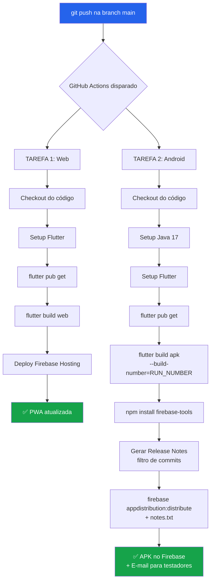

# 📦 Estratégia de Versionamento e CI/CD

> Documento de referência para a pipeline de Integração Contínua e Entrega Contínua do IFdex.
> Última atualização: 2026-05-04.

---

## Índice

1. [Anatomia da Versão Flutter](#1-anatomia-da-versão-flutter)
2. [O que é Automático vs. Manual](#2-o-que-é-automático-vs-manual)
3. [Como o `github.run_number` Funciona](#3-como-o-githubrun_number-funciona)
4. [Release Notes Inteligentes (Conventional Commits)](#4-release-notes-inteligentes-conventional-commits)
5. [Fluxo Completo da Pipeline](#5-fluxo-completo-da-pipeline)
6. [Guia de Situações: Quando e Como Mexer](#6-guia-de-situações-quando-e-como-mexer)
7. [Referência Rápida de Secrets](#7-referência-rápida-de-secrets)
8. [Anatomia Completa do Workflow YAML](#8-anatomia-completa-do-workflow-yaml)

---

## 1. Anatomia da Versão Flutter

No Flutter, a versão do `pubspec.yaml` segue o formato:

```
version: MAJOR.MINOR.PATCH+BUILD_NUMBER
         └─────────┬──────────┘ └────┬────┘
          Versão Pública           Código
          (Semântica)            Interno
```

### Explicação de cada componente

| Componente       | Significado                                  | Quem controla? | Exemplo |
| :--------------- | :------------------------------------------- | :------------- | :------ |
| **MAJOR** (`X`)  | Mudança grande/incompatível (ex: Fase 2 com Firebase Auth real) | **Você** (manual) | `2.0.0` |
| **MINOR** (`Y`)  | Nova funcionalidade compatível (ex: Tela de Compartilhamento) | **Você** (manual) | `1.1.0` |
| **PATCH** (`Z`)  | Correção de bug (ex: Fix na barra de XP)     | **Você** (manual) | `1.0.1` |
| **BUILD** (`+N`) | Identificador interno da compilação           | **GitHub Actions** (automático) | `+42` |

### Regra de Ouro

> **A Versão Pública (`X.Y.Z`) é a sua decisão criativa.**
> **O Build Number (`+N`) é responsabilidade da máquina.**

Exemplo prático do que acontece no `pubspec.yaml` ao longo do tempo:

```
pubspec.yaml diz: version: 1.0.0+1    ←── Você nunca precisa mudar o "+1"
                                            O GitHub ignora e injeta o run_number

Push #16  →  Compila como:  1.0.0+16
Push #17  →  Compila como:  1.0.0+17
Push #18  →  Compila como:  1.0.0+18

(Você decide que lançou a Fase 2, edita o pubspec para 2.0.0+1)

Push #80  →  Compila como:  2.0.0+80
Push #81  →  Compila como:  2.0.0+81
```

> [!IMPORTANT]
> O Firebase App Distribution e a Google Play Store só exigem uma regra:
> **o Build Number do APK novo deve ser matematicamente MAIOR que o do anterior.**
> Como `github.run_number` é estritamente crescente, isso é garantido automaticamente.

---

## 2. O que é Automático vs. Manual

### ✅ Automático (Pipeline faz sozinha)

| Item | Mecanismo |
| :--- | :-------- |
| Build Number (`+N`) | `--build-number=${{ github.run_number }}` injetado no comando `flutter build` |
| Release Notes | Script de filtragem de Conventional Commits gera `notes.txt` automaticamente |
| Distribuição | Firebase CLI envia APK + notas para o grupo `proj-mobile` |
| Deploy Web | Firebase Hosting publica automaticamente no merge na `main` |

### ✋ Manual (Você decide quando mudar)

| Item | Onde mudar | Quando mudar |
| :--- | :--------- | :----------- |
| Versão Pública (`X.Y.Z`) | `pubspec.yaml` (linha `version:`) | Ao lançar feature significativa, correção importante, ou nova fase do projeto |

> [!TIP]
> **Isso é o padrão da indústria.** Empresas como Google, Meta e Nubank mantêm a versão pública manual
> e automatizam apenas o build number. A versão pública é uma decisão de **produto**, não de engenharia.

---

## 3. Como o `github.run_number` Funciona

O `github.run_number` é um contador **global por workflow** no GitHub Actions.

### Características

- **Escopo:** Único por arquivo de workflow (`.yml`).
- **Incremento:** Sempre soma `+1` a cada execução, independentemente de sucesso ou falha.
- **Persistência:** Nunca reseta (mesmo deletando runs antigos).
- **Sem lacunas:** Se o run 15 falhou, o próximo será 16. Não existe "reuso" de número.

### Diferença entre `run_number` e `run_id`

| Variável | Tipo | Exemplo | Uso ideal |
| :------- | :--- | :------ | :-------- |
| `github.run_number` | Sequencial crescente | `16`, `17`, `18` | **Build Number** (nosso caso) |
| `github.run_id` | ID único global | `8234567890` | Rastreamento de logs, debug |

---

## 4. Release Notes Inteligentes (Conventional Commits)

### O Problema

Sem automação, as notas de versão enviadas ao Firebase seriam vazias ou genéricas.
Queremos que os testadores recebam **exatamente** as mudanças relevantes daquele build.

### A Solução: Filtro de Conventional Commits

O script no pipeline pega **todas** as mensagens de commit do push e filtra
apenas as que seguem o padrão de [Conventional Commits](https://www.conventionalcommits.org/):

#### Prefixos Capturados

| Prefixo     | Significado                          | Aparece nas notas? |
| :---------- | :----------------------------------- | :----------------: |
| `feat:`     | Nova funcionalidade                  | ✅ Sim             |
| `fix:`      | Correção de bug                      | ✅ Sim             |
| `refactor:` | Reestruturação sem mudar comportamento | ✅ Sim           |
| `perf:`     | Melhoria de performance              | ✅ Sim             |
| `docs:`     | Mudança em documentação              | ✅ Sim             |
| `style:`    | Formatação, espaçamento              | ✅ Sim             |
| `chore:`    | Tarefas de manutenção                | ❌ **Filtrado**    |
| `ci:`       | Mudanças na pipeline                 | ❌ **Filtrado**    |
| `test:`     | Adição/ajuste de testes              | ❌ **Filtrado**    |
| `wip`       | Trabalho em progresso                | ❌ **Filtrado**    |
| `ajuste`    | Mensagem genérica                    | ❌ **Filtrado**    |

### Como funciona tecnicamente

```bash
# 1. O GitHub injeta todas as mensagens de commit do push como JSON
#    Exemplo: ["feat: novo form", "chore: lint", "fix: cor do botão"]

# 2. O jq transforma o JSON em texto linha a linha:
#    feat: novo form
#    chore: lint
#    fix: cor do botão

# 3. O grep filtra apenas as linhas com prefixos válidos:
#    feat: novo form
#    fix: cor do botão

# 4. Resultado salvo em notes.txt e enviado ao Firebase
```

### Exemplo Real

Você roda localmente:
```bash
git commit -m "feat: adicionado bloqueio no form do sispubli"
git commit -m "chore: formatado codigo"
git commit -m "fix: cor da barra de xp"
git push
```

O e-mail que os testadores recebem pelo Firebase terá:
```
feat: adicionado bloqueio no form do sispubli
fix: cor da barra de xp
```

> [!NOTE]
> Se **nenhum** commit seguir o padrão (ex: todos são `chore:` ou mensagens genéricas),
> o script gera automaticamente a mensagem fallback:
> `"Pequenos ajustes de interface e correções de bugs."`

---

## 5. Fluxo Completo da Pipeline



### Duas tarefas paralelas

As tarefas **Web** e **Android** rodam em **paralelo** (são `jobs` separados).
Isso significa que o deploy web não espera o Android terminar, e vice-versa.

---

## 6. Guia de Situações: Quando e Como Mexer

### Situação 1: "Fiz vários commits pequenos e quero distribuir"

**Ação:** Simplesmente faça `git push`. A pipeline cuida de tudo.
- O build number será incrementado automaticamente.
- As release notes serão filtradas dos seus commits.

### Situação 2: "Lancei uma feature importante e quero bumpar a versão"

**Ação:** Edite manualmente o `pubspec.yaml`:

```yaml
# Antes
version: 1.0.0+1

# Depois (exemplo: feature de compartilhamento)
version: 1.1.0+1
```

> [!TIP]
> O `+1` no pubspec é irrelevante — o GitHub vai sobrescrever com o `run_number`.
> Mas manter `+1` no arquivo é uma boa prática de legibilidade.

### Situação 3: "Corrigi um bug crítico em produção"

**Ação:** Bump do PATCH no `pubspec.yaml`:

```yaml
version: 1.0.1+1
```

### Situação 4: "Preciso enviar o APK para a Play Store (futuro)"

**Ação:** O APK gerado pela pipeline já tem o build number correto.
Basta baixar o artefato do GitHub Actions ou pegar do Firebase App Distribution.
A Play Store vai aceitar porque o `versionCode` (build number) é sempre crescente.

### Situação 5: "A pipeline falhou, preciso rodar de novo"

**Ação:** Vá em `Actions` no GitHub → clique no run que falhou → `Re-run all jobs`.
O `run_number` será um **novo número** (não reusa o antigo), então o build number
continuará crescente sem conflitos.

### Situação 6: "Quero mudar os prefixos aceitos nas release notes"

**Ação:** Edite a regex no step `Gerar Release Notes Inteligentes` do workflow:

```bash
# Atual (aceita feat, fix, refactor, perf, docs, style):
grep -iE '^(feat|fix|refactor|perf|docs|style)' > notes.txt

# Para aceitar também "test:" e "build:":
grep -iE '^(feat|fix|refactor|perf|docs|style|test|build)' > notes.txt
```

### Situação 7: "Quero mudar o grupo de testadores no Firebase"

**Ação:** Edite o parâmetro `--groups` no step de distribuição:

```bash
# Atual:
--groups "proj-mobile"

# Para enviar para dois grupos:
--groups "proj-mobile,beta-testers"
```

### Situação 8: "Preciso lançar a Fase 2 do projeto (MAJOR bump)"

**Ação:** Edite o `pubspec.yaml`:

```yaml
version: 2.0.0+1
```

A partir do próximo push, a versão pública será `2.0.0` e o build number
continuará crescendo a partir do `run_number` atual.

---

## 7. Referência Rápida de Secrets

Estas variáveis devem estar configuradas em **Settings → Secrets and variables → Actions** no GitHub:

| Secret | Descrição | Como obter |
| :----- | :-------- | :--------- |
| `FIREBASE_SERVICE_ACCOUNT_IFDEX_APP` | Conta de serviço para Firebase Hosting | Gerada automaticamente pelo Firebase CLI (`firebase init hosting:github`) |
| `FIREBASE_ANDROID_APP_ID` | ID do app Android no Firebase | Console Firebase → Configurações do projeto → Apps → ID do app Android (formato: `1:XXXX:android:XXXX`) |
| `FIREBASE_TOKEN` | Token de autenticação CI do Firebase | Executar `firebase login:ci` no terminal local e copiar o token gerado |

> [!CAUTION]
> **NUNCA** commite tokens, service accounts ou credenciais no repositório.
> Utilize exclusivamente GitHub Secrets para injetar dados sensíveis na pipeline.

---

## 8. Anatomia Completa do Workflow YAML

O arquivo de referência é:
`.github/workflows/firebase-hosting-merge.yml`

### Tarefa 1: Deploy Web

```yaml
build_and_deploy_web:
  runs-on: ubuntu-latest
  steps:
    - uses: actions/checkout@v4         # Baixa o código
    - uses: subosito/flutter-action@v2  # Instala Flutter
      with:
        channel: 'stable'
    - run: flutter pub get              # Dependências
    - run: flutter build web            # Compila PWA
    - uses: FirebaseExtended/action-hosting-deploy@v0  # Publica
```

### Tarefa 2: Distribuição Android

```yaml
build_and_distribute_android:
  runs-on: ubuntu-latest
  steps:
    - uses: actions/checkout@v4
      with:
        fetch-depth: 0                  # Pega histórico completo (para commits)
    - uses: actions/setup-java@v3       # Java 17 para Gradle
    - uses: subosito/flutter-action@v2  # Flutter
    - run: flutter pub get
    - run: flutter build apk --release --build-number=${{ github.run_number }}
    #       ↑ Aqui está a magia: o run_number substitui o +1 do pubspec
    - run: npm install -g firebase-tools
    - name: Gerar Release Notes         # Filtro de Conventional Commits
    - name: Enviar APK                   # firebase appdistribution:distribute
```

### Segurança das Release Notes

O script de notas usa `|| true` no final do `grep` para garantir que:
- Se **zero** commits passarem no filtro, o comando **não falha** a pipeline.
- O bloco `if [ ! -s notes.txt ]` detecta o arquivo vazio e escreve a mensagem fallback.

---

## Resumo Visual

```
┌─────────────────────────────────────────────────────────┐
│                    pubspec.yaml                         │
│                  version: 1.0.0+1                       │
│                  ───────── ─┬─ ─┬─                      │
│                      │      │   │                       │
│              Manual ←┘      │   └→ Ignorado             │
│          (sua decisão)      │      pelo CI              │
│                             │                           │
│                    ┌────────┴────────┐                   │
│                    │  GitHub Actions │                   │
│                    │  run_number: 42 │                   │
│                    └────────┬────────┘                   │
│                             │                           │
│                    APK final: 1.0.0+42                   │
│                    Release Notes: [commits filtrados]    │
│                    Destino: Firebase App Distribution    │
└─────────────────────────────────────────────────────────┘
```
