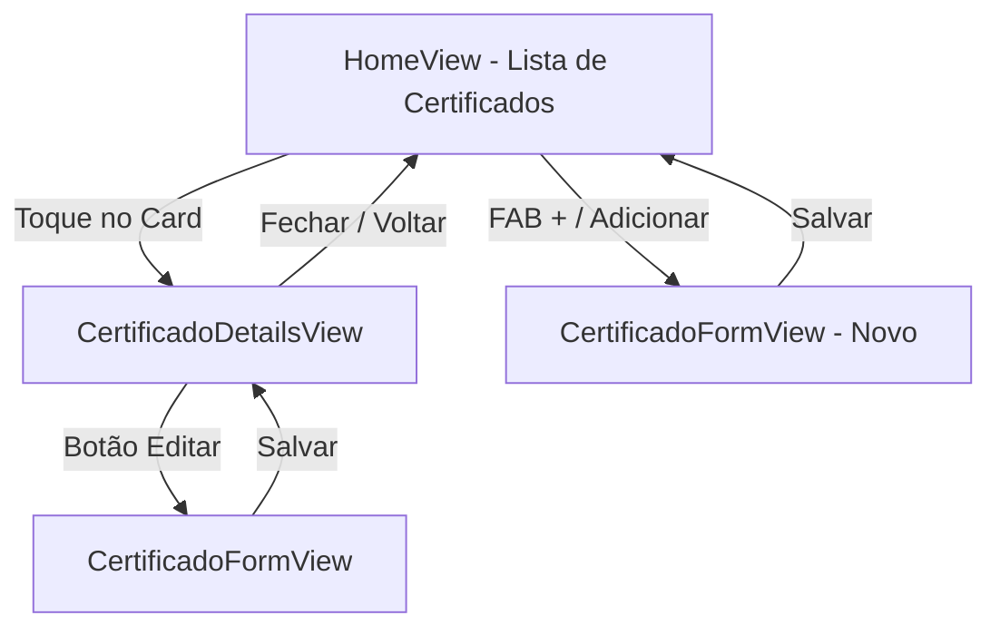

# 📋 Fluxo de Certificado: Detalhes → Edição

> Fonte da Verdade para o comportamento das telas
> `CertificadoDetailsView` e `CertificadoFormView`.

---

## 1. Visão Geral do Fluxo



**Resumo:** Todo clique em certificado na Home abre a **DetailsView** (leitura). A edição acontece na **FormView**, acessível via botão "Editar" dentro da DetailsView. Certificados novos são criados diretamente pelo FAB da Home.

---

## 2. CertificadoDetailsView (Tela de Leitura)

**Arquivo:** `lib/views/certificado_details_view.dart`
**Tipo:** `StatelessWidget` — sem estado interno, puramente visual.

### 2.1 Layout

| Dispositivo      | Comportamento                                                |
| :--------------- | :----------------------------------------------------------- |
| Mobile (< 700px) | `Column` — Cover no topo, conteúdo abaixo (scroll vertical)  |
| Web (≥ 700px)    | `Row` — Cover lateral (240px), conteúdo ao lado (scroll)     |

### 2.2 Dados Exibidos (Idênticos para ambas as origens)

Todos os campos são exibidos usando `InfoBox` + `AppText`:

| Seção         | Fonte                        | Widget Usado                   |
| :------------ | :--------------------------- | :----------------------------- |
| Título        | `certificado.titulo`         | `InfoBox` → `AppText`          |
| Instituição   | `certificado.instituicao`    | `InfoBox` → `AppText`          |
| Tipo          | `certificado.tipoDescricao`  | `InfoBox` → `AppText`          |
| Ano           | `certificado.ano`            | `InfoBox` → `AppText`          |
| Relevância    | `certificado.notaRelevancia` | Estrelas (⭐ × 5)              |
| Carga Horária | `certificado.cargaHoraria`   | `InfoBox` → "N/A" se nulo      |
| Tags          | `certificado.tags`           | `Wrap` de `Chip`s ou "Nenhuma" |

### 2.3 Diferença Visual por Origem

| Origem       | Selo Extra                                                                                 |
| :----------- | :----------------------------------------------------------------------------------------- |
| **Sispubli** | `InfoBox` "IDENTIFICADOR DE SEGURANÇA" com ícone ✅ e texto "SISPUBLI OFICIAL"              |
| **Manual**   | Nenhum selo adicional                                                                      |

### 2.4 Botões de Ação (Renderização Condicional)

| Botão                  | Condição de Visibilidade             | Ação                                                                          |
| :--------------------- | :----------------------------------- | :---------------------------------------------------------------------------- |
| **Acessar Link**       | `urlDocumento != null && .isNotEmpty` | Abre o navegador externo via `url_launcher`                                   |
| **Visualizar Arquivo** | `uploadDocumento != null` E sem URL  | SnackBar: "Integração na Fase 2" (MVP)                                        |
| **Copiar Link**        | `urlDocumento != null && .isNotEmpty` | `Clipboard.setData` + SnackBar "Link copiado para a área de transferência"    |
| **Editar**             | **Sempre visível** (ambas origens)   | `Navigator.push` → `CertificadoFormView`                                     |
| **Fechar**             | **Sempre visível**                   | `Navigator.pop(context)`                                                      |

> **Nota:** "Acessar Link" e "Visualizar Arquivo" são mutuamente exclusivos.

### 2.5 Propagação de Edição

1. FormView retorna `{'certificado': novo, 'index': editIndex}` via `Navigator.pop`.
2. DetailsView intercepta e faz `Navigator.pop(ctx, resultado)` para propagar à HomeView.
3. O ViewModel (via Riverpod) atualiza o estado global automaticamente.

---

## 3. CertificadoFormView (Tela de Edição / Cadastro)

**Arquivo:** `lib/views/certificado_form_view.dart`
**Tipo:** `StatefulWidget` — controladores, estado de upload e validação.

### 3.1 Comportamento Transmórfico

| Contexto            | AppBar Title          | Campos Editáveis |
| :------------------ | :-------------------- | :--------------- |
| Novo certificado    | "Registro Manual"     | Todos            |
| Edição de manual    | "Editar Certificado"  | Todos            |
| Edição de Sispubli  | "Editar Metadados"    | Apenas metadados |

### 3.2 Matriz de Bloqueio por Origem

A flag `_isSispubli` controla o que é renderizado:

| Campo             | Manual                     | Sispubli                          |
| :---------------- | :------------------------- | :-------------------------------- |
| Título            | `TextFormField` editável   | `InfoBox` "(BLOQUEADO)" read-only |
| Instituição       | `TextFormField` editável   | `InfoBox` "(BLOQUEADO)" read-only |
| Ano               | `TextFormField` editável   | `InfoBox` "(BLOQUEADO)" read-only |
| Tipo de Descrição | `DropdownButtonFormField`   | `InfoBox` "(BLOQUEADO)" read-only |
| Carga Horária     | `TextFormField` (opcional) | ✅ `TextFormField` (editável)     |
| Tags              | `TextFormField` (validado) | ✅ `TextFormField` (editável)     |
| Nota Relevância   | Estrelas interativas       | ✅ Estrelas interativas           |
| Comprovação       | `SegmentedButton` + área   | Oculta (URL vem da API)          |

### 3.3 Regras de Validação por Campo

| Campo         | Regra de Validação                   | Limite no Modelo |
| :------------ | :----------------------------------- | :--------------- |
| Título        | Obrigatório, máx 100 chars          | ✅ max 100       |
| Instituição   | Obrigatório                          | Não-vazio        |
| Ano           | Obrigatório, entre 1900 e ano atual | ✅ 1900–2026     |
| Carga Horária | Opcional, 1–5000 se preenchido       | ✅ 1–5000        |
| Tags          | Máx 5 tags, máx 20 chars por tag    | ✅ 5 tags/20ch   |
| URL           | Formato URL válido (se preenchido)   | URI absoluta     |
| Upload        | .pdf/.jpg/.png, máx 10MB            | ✅ 10MB          |
| Relevância    | 1–5 (via estrelas)                   | ✅ 1–5           |

### 3.4 Comprovação: Exclusão Mútua (Apenas Manual)

```
Se "Link Externo" selecionado → Exibe TextFormField de URL, oculta Upload
Se "Upload Arquivo" selecionado → Exibe Upload Box, limpa URL
```

### 3.5 Salvar — Merge de Dados

Para Sispubli, o `_salvar` preserva os dados originais da API:

- `titulo`, `instituicao`, `ano`, `tipoDescricao` → copiados de `widget.certificado`
- `urlDocumento`, `uploadDocumento` → copiados de `widget.certificado`
- `cargaHoraria` → valor do formulário (enriquecimento do usuário)
- `tags`, `notaRelevancia` → valores do formulário

---

## 4. Pacotes Envolvidos

| Pacote         | Uso                                                  |
| :------------- | :--------------------------------------------------- |
| `url_launcher` | Abrir links de documentos no navegador (DetailsView) |
| `file_picker`  | Upload de .pdf/.jpg/.png (FormView)                  |
| `uuid`         | IDs para certificados manuais (FormView)             |

---

## 5. Referências

- Modelo de Dados: [`docs/certificado_spec.md`](./certificado_spec.md)
- Design System: [`DESIGN.md`](../DESIGN.md)
- Spec do Projeto: [`AGENTS.md`](../AGENTS.md)
